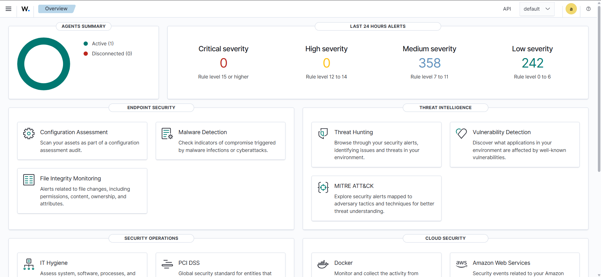
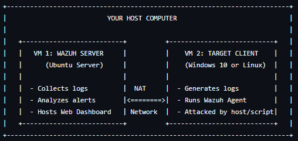
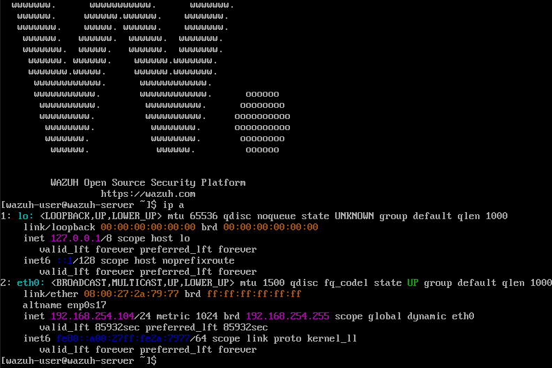
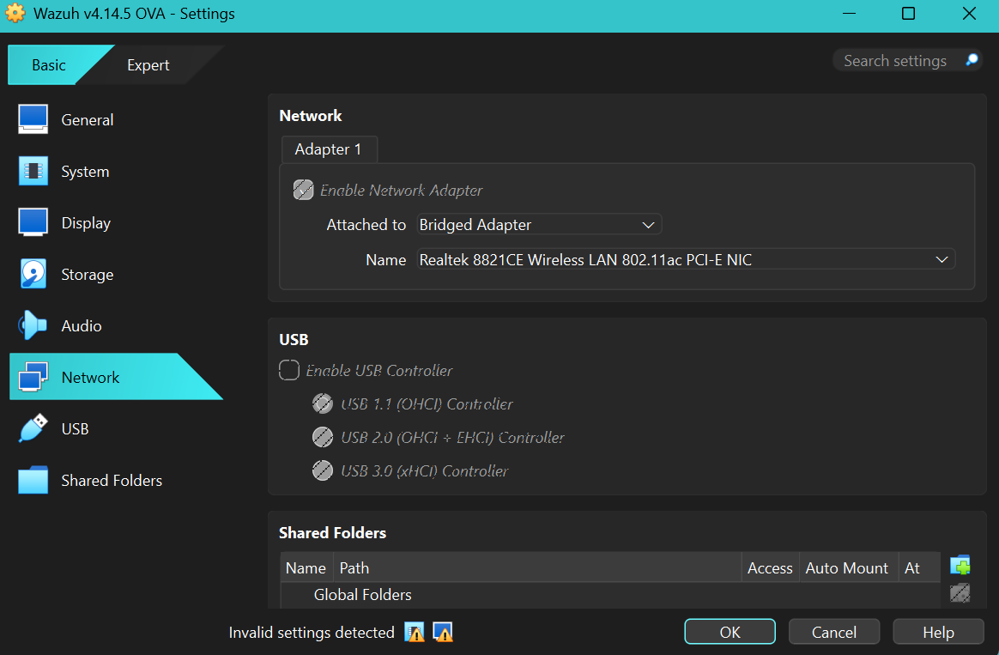
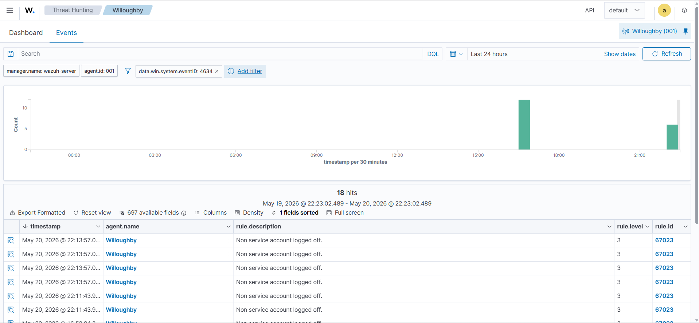
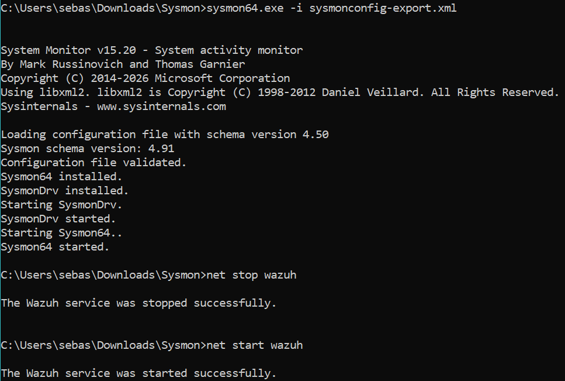
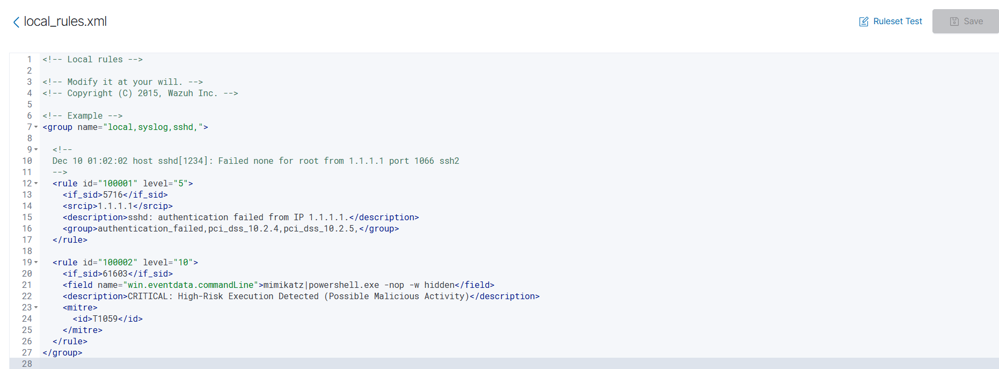
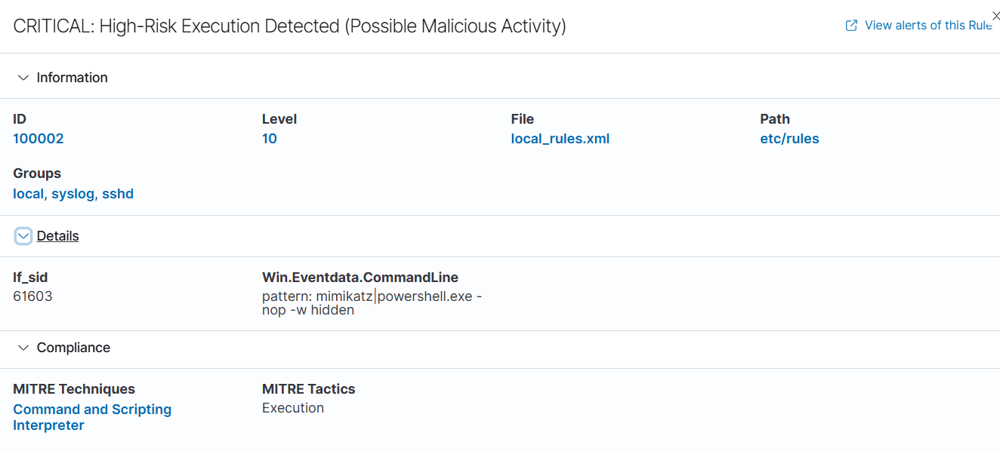
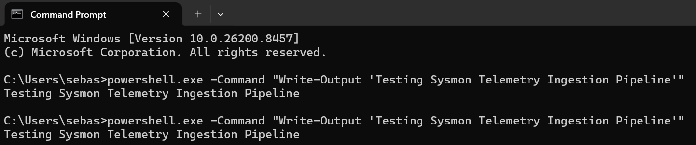
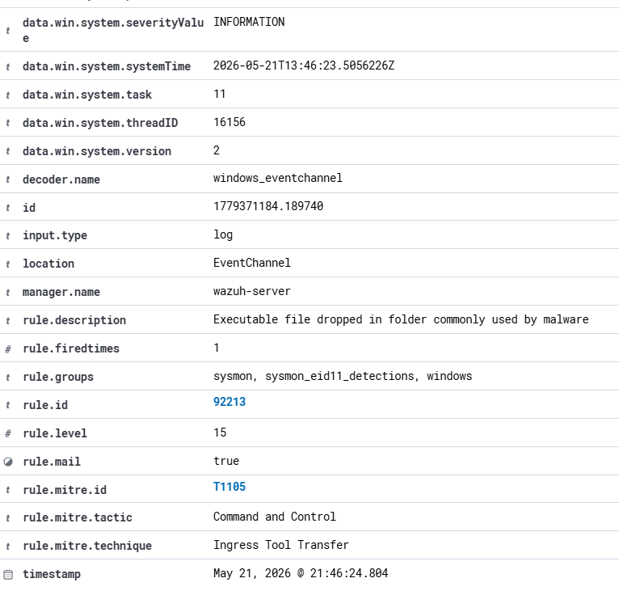

#  Building a Specialized SIEM & Automated Incident Response Pipeline


##  Project Overview


This project demonstrates the engineering, deployment, and testing of a centralized security telemetry pipeline using an enterprise-grade SIEM/XDR platform (**Wazuh**). The objective was to design a virtual network infrastructure that streams live endpoint data from a Windows target client, parses security events, and establishes automated defensive countermeasures to actively halt simulated cyber attacks.



---


##  Lab Architecture & Components


* **SIEM Central Engine/Dashboard:** Wazuh v4.14.5 OVA Appliance running a hardened Amazon Linux base.

* **Monitored Endpoint (Target):** Windows 10/11 workstation running a lightweight, silent Wazuh monitoring agent service.

* **Hypervisor:** Oracle VM VirtualBox.

* **Network Strategy:** Bridged Networking (enabling direct local subnet visibility and authentic routing protocols).


---


##  Phases of Implementation


### Phase 1: Virtual Infrastructure & Pipeline Engineering


* Provisioned and deployed the central Wazuh SIEM virtual appliance.
  


* Engineered the network mapping by transitioning the environment from isolated NAT to **Bridged Adapter mode**, assigning the server a dedicated identity on the local subnet.
  


* Deployed the monitoring agent on the Windows client using administrative command-line parameters (`msiexec`) to link it seamlessly to the manager core.
   
```
msiexec /i "C:\Program Files (x86)\ossec-agent\wazuh-agent-4.14.5-1.msi" /q WAZUH_MANAGER="192.168.254.104"
```
---

### Phase 2: Active Threat Simulation (Brute-Force Detection)


* **Objective:** Replicate an adversarial credential-guessing/dictionary attack targeting a Windows workstation.

* **Execution:** Generated consecutive, rapid authentication failures on the Windows target client utilizing unprivileged and illegitimate user accounts (e.g., `Hacker`).

* **Analysis:** Monitored ingestion speeds and successfully captured **Windows Event ID 4625** (An account failed to log in) inside the SIEM dashboard under **Rule ID 60122** (`Logon Failure - Unknown user or bad password`).





### Phase 3: Active Response Integration (Automated Containment)


* Configured an automated remediation playbook within the server's central configuration (`ossec.conf`) targeted at **Rule 60122**.

* **Mechanism:** Upon detecting the brute-force threshold, the server instructs the target client to instantly execute a `netsh-win` script, blocking the malicious source IP address via the Windows Firewall for 600 seconds.

This command tells Windows to run the "netsh" script when it detects ruleID 60122 also know as a failed login attempt:

```
<active-response>
  <command>netsh-win</command>
  <location>local</location>
  <rules_id>60122</rules_id>
  <timeout>600</timeout>
</active-response>
```
---

## 📈 Phase 4: Advanced Telemetry Ingestion (Microsoft Sysmon Integration)

* **Objective:** Expand endpoint visibility beyond basic Windows security events to catch advanced execution techniques (like malicious PowerShell activity or ransomware process trees).
* **Implementation:** Deployed **Microsoft Sysmon** using the industry-standard *SwiftOnSecurity* configuration template to filter out background noise and focus heavily on adversarial tactics.
  


* **Pipeline Configuration:** Modified the local agent's `ossec.conf` layer to monitor and ship the hidden `Microsoft-Windows-Sysmon/Operational` event channel.
  




* **Validation:** Executed a simulated obfuscated command via PowerShell, verifying that **Sysmon Event ID 1 (Process Creation)** cleanly ingested into the central dashboard—successfully capturing the parent process, process GUID, and full command-line strings.
  




---

* ### 🔍 Real-World Log Analysis: Tuning & False Positives
During validation of the Sysmon pipeline, the central manager triggered a **Level 15 Critical Alert (Rule 92213: Executable file dropped in folder commonly used by malware)**, mapping to **MITRE ATT&CK T1105 (Ingress Tool Transfer)**. 

* **Triage Analysis:** Upon inspecting the raw telemetry metadata, the `data.win.eventdata.targetFilename` was identified as:
  `C:\Users\sebas\AppData\Local\Temp\__PSScriptPolicyTest_xxxxxx.ps1`
* **Root Cause Determination:** This was triaged as a **False Positive**. Investigation revealed this is a native Windows mechanism where PowerShell generates a temporary file in the `\Temp` directory to validate local script execution policies. 
* **Engineering Takeaway:** This highlighted the high-fidelity nature of Sysmon Event ID 11 (File Create) and demonstrated the critical need for SIEM baseline tuning to reduce alert fatigue in an enterprise SOC environment.

---

## 🛠️ Troubleshooting & Engineering Breakthroughs


*The most critical part of this deployment involved diagnosing connection drops (`ERROR: (1208) Unable to connect to enrollment service`). Here is how it was resolved:*


1. **Isolating Network Disconnects:** Identified that standard NAT mode created an isolation barrier between the server and agent. Bridging the hypervisor network adapters restored visibility.

2. **OS/Distribution Assessment:** Evaluated core firewall compatibility issues. Navigated variations between Ubuntu (`ufw`) and Red Hat/Amazon Linux environments, optimizing the architecture configuration to fit the appliance's native security policies.

3. **Privilege Elevation:** Bypassed Windows directory access restrictions by utilizing elevated administrative shells to inspect the active cryptographic handshakes inside `ossec.log`.


---


##  Core Skills Demonstrated


* **SIEM/XDR Engineering:** Ingesting and parsing endpoint security logs.

* **Endpoint Telemetry:** Reading and classifying Microsoft Security Event logs.

* **Incident Response Automation:** Creating SOAR-like active response policies for threat containment.

* **Systems & Network Architecture:** Diagnosing virtual network layers, subnets, routing, and access controls.

### Key Skills Added:

* Advanced Endpoint Detection & Tracking (EDR/XDR design)
* Log Channel Modification & XML Configuration
* Process Lineage & Command-Line Telemetry Analysis

